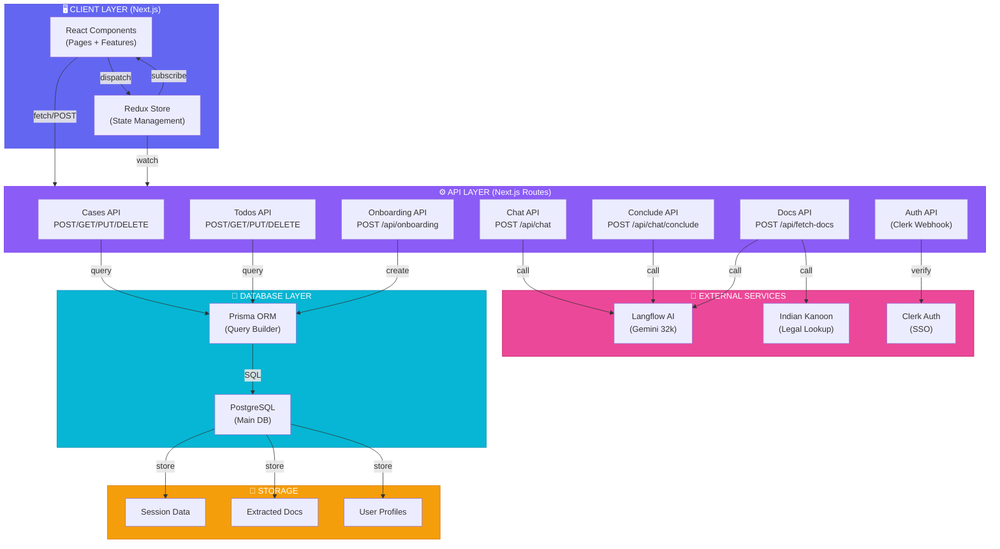
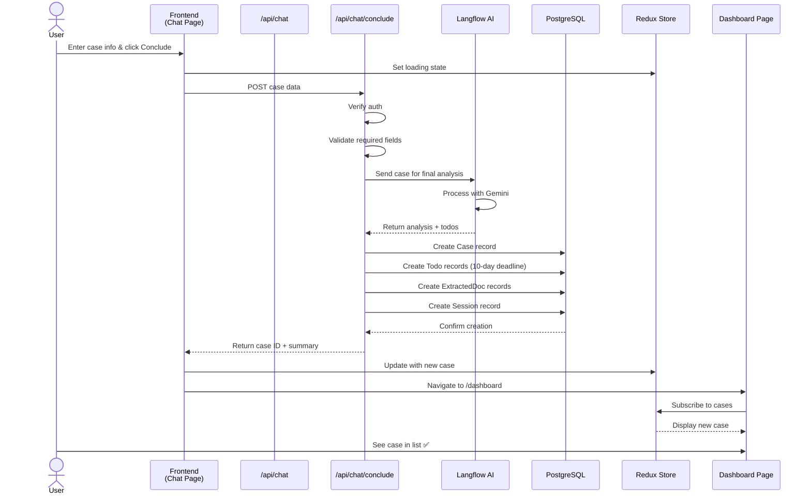
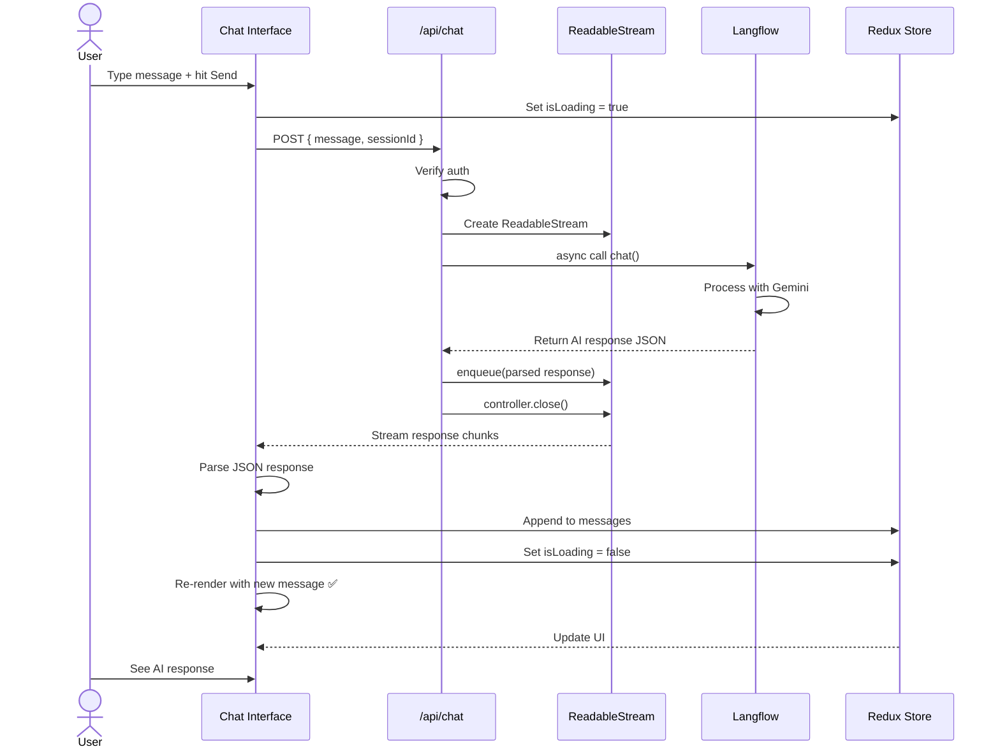
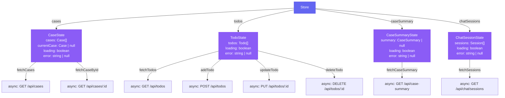
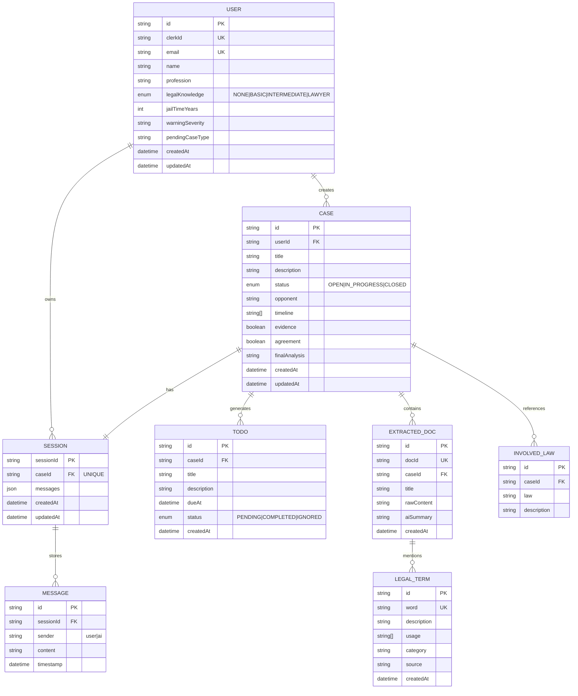
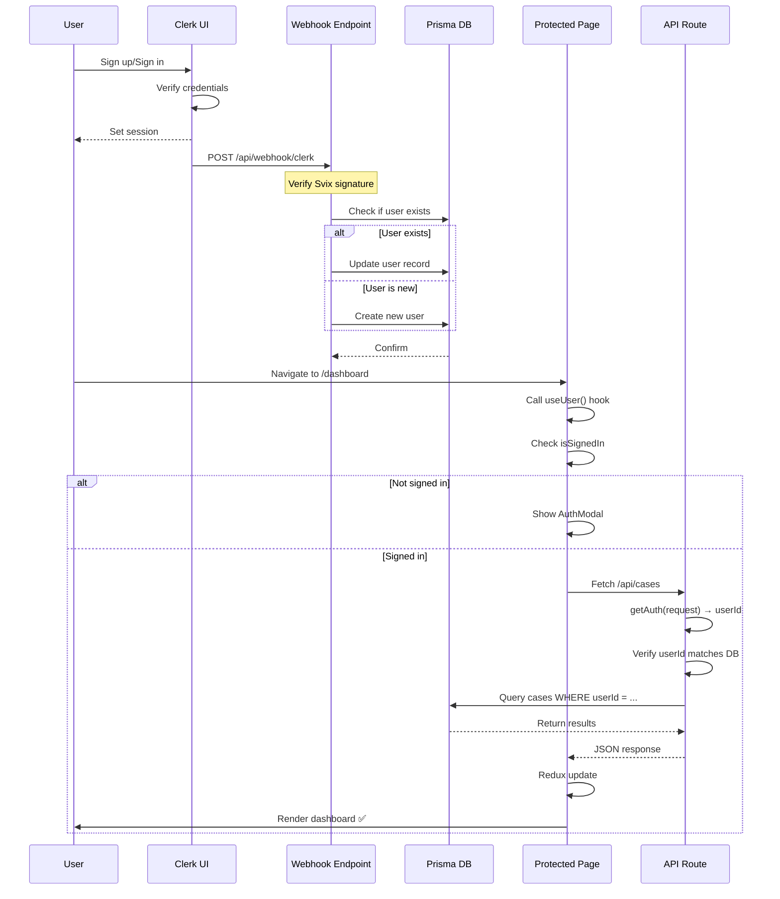

# NyayVaad Architecture & Data Flow Diagrams

## System Architecture Diagram



## Data Flow: Case Creation to Dashboard



## Data Flow: Chat Message Processing



## Data Flow: Document Processing

```mermaid
graph LR
    A["POST /api/fetch-docs<br/>{description, caseId}"] 
    |Auth check|
    B["Validate input"]
    
    B -->|Get case| C["Query Database"]
    C -->|Success| D["Step 1:<br/>Keyword Extraction"]
    C -->|Fail| Z["❌ Return 404"]
    
    D -->|Call Langflow| E["Langflow extracts<br/>query_keywords"]
    E -->|Parse JSON| F["Extract keyword"]
    
    F -->|Search| G["Step 2:<br/>Indian Kanoon API"]
    G -->|Get results| H["Extract ACT/Section"]
    
    H -->|Fetch full text| I["Step 3:<br/>Summarize"]
    I -->|Call Langflow| J["Langflow creates<br/>aiSummary"]
    
    J -->|Parse| K["Step 4:<br/>Save to DB"]
    K -->|Upsert| L["Prisma ExtractedDoc"]
    
    L -->|Success| M["Return documents[]<br/>✅ 200 OK"]
    E -->|Parse error| N["❌ Return 400"]
    G -->|No results| O["❌ Return 400"]
    J -->|Parse error| P["❌ Return 400"]
    
    style A fill:#6366f1,stroke:#4f46e5,color:#fff
    style D fill:#8b5cf6,stroke:#7c3aed
    style G fill:#8b5cf6,stroke:#7c3aed
    style I fill:#8b5cf6,stroke:#7c3aed
    style M fill:#10b981
    style Z fill:#ef4444
    style N fill:#ef4444
    style O fill:#ef4444
    style P fill:#ef4444
```

## Redux State Tree



## Component Hierarchy

```mermaid
graph TD
    APP["&lt;RootLayout&gt;<br/>Clerk + Redux Provider"]
    
    APP -->|/" | HOME["Home Page<br/>Landing Features Pricing"]
    APP -->|/dashboard| DASH["DashboardPage<br/>Main Hub"]
    APP -->|/chat| CHAT["ChatPage<br/>Case Creation"]
    APP -->|/onboarding| ONBOARD["OnboardingPage<br/>User Setup"]
    
    DASH -->|Protected| PROTECTED["ProtectedPage<br/>Auth Guard"]
    PROTECTED -->|render| DASH_CONTENT["Dashboard Content"]
    
    DASH_CONTENT -->|components| CASES_SEC["CasesSection<br/>List + Filter"]
    DASH_CONTENT -->|components| TODO_LIST["Todo List<br/>Multiple TodoItem"]
    DASH_CONTENT -->|components| CAL["CalendarView<br/>Deadline Tracker"]
    
    CASES_SEC -->|display| CASE_CARD["Case Card<br/>Title+Status+Date"]
    TODO_LIST -->|render| TODOITEM["TodoItem<br/>Single Todo UI"]
    
    CHAT -->|components| MSG_LIST["Message List"]
    CHAT -->|components| INPUT["Chat Input"]
    CHAT -->|components| TODO_GEN["Auto Todo Generator"]
    
    ONBOARD -->|form| STEP1["Step 1: Language"]
    ONBOARD -->|form| STEP2["Step 2: Profile"]
    ONBOARD -->|form| STEP3["Step 3: Case Type"]
    
    HOME -->|layout| HEADER["Header<br/>Navigation"]
    HOME -->|layout| FOOTER["Footer<br/>Links"]
    HOME -->|features| PARALLAX["ParallaxFeatures"]
    HOME -->|features| PRICING["Pricing Component"]
    HOME -->|features| PIN["3D Pin Cards"]
    
    style APP fill:#6366f1,stroke:#4f46e5,color:#fff
    style PROTECTED fill:#ec4899,stroke:#be185d,color:#fff
    style CASES_SEC fill:#8b5cf6,stroke:#7c3aed,color:#fff
    style TODO_LIST fill:#8b5cf6,stroke:#7c3aed,color:#fff
    style CAL fill:#8b5cf6,stroke:#7c3aed,color:#fff
```

## Database Entity Relationships



## API Route Tree

```
/api/
├── cases/
│   ├── route.ts              [GET] List user's cases
│   │                         [POST] Create case (WIP)
│   └── [caseId]/
│       ├── route.ts          [GET] Case detail (WIP)
│       │                     [PUT] Update case (WIP)
│       │                     [DELETE] Delete case (WIP)
│       └── (case-specific routes)
│
├── todos/
│   ├── route.ts              [GET] List todos
│   │                         [POST] Create todo
│   └── [todoId]/
│       ├── route.ts          [PUT] Update todo (WIP)
│       │                     [DELETE] Delete todo (WIP)
│
├── chat/
│   ├── route.ts              [POST] Chat message (Langflow)
│   ├── conclude/
│   │   └── route.ts          [POST] Finalize case
│   └── sessions/
│       └── route.ts          [GET] List sessions (BROKEN)
│
├── fetch-docs/
│   └── route.ts              [POST] Extract docs (Langflow + Kanoon)
│
├── onboarding/
│   └── route.ts              [POST] Complete profile
│
├── reminders/
│   └── route.ts              [POST] Set reminder
│
├── contact/
│   └── route.ts              [POST] Contact form
│
└── webhook/
    └── clerk/
        └── route.ts          [POST] Auth sync
```

## Component Integration Example

```mermaid
graph LR
    A["DashboardPage<br/>Main Container"]
    |"useDispatch"|
    B["Redux Dispatcher"]
    |"dispatch(fetchCases)"|
    C["fetchCases<br/>AsyncThunk"]
    |"fetch /api/cases"|
    D["GET /api/cases<br/>API Route"]
    |"query Prisma"|
    E["PostgreSQL<br/>Query"]
    
    E -->|"return Cases[]"| D
    D -->|"JSON response"| C
    C -->|"payload"| B
    B -->|"cases.fulfilled"| F["caseSlice<br/>Reducer"]
    F -->|"state update"| G["Redux Store"]
    G -->|"useSelector"| H["CasesSection<br/>Component"]
    H -->|"render"| I["Case Cards<br/>UI"]
    
    style A fill:#6366f1,color:#fff
    style I fill:#10b981,color:#fff
```

## Authentication & Authorization Flow



---

## File Structure Tree

```
📦 nyaayvaad/
├── 📄 package.json
├── 📄 tsconfig.json
├── 📄 next.config.ts
├── 🔒 prisma/
│   ├── schema.prisma
│   └── migrations/
│       ├── migration_lock.toml
│       └── <timestamp>_migration/
│           └── migration.sql
├── 📁 src/
│   ├── 📄 middleware.ts (Clerk)
│   ├── 🎨 app/
│   │   ├── page.tsx (Landing)
│   │   ├── layout.tsx (Root)
│   │   ├── globals.css
│   │   ├── 📁 api/
│   │   │   ├── cases/
│   │   │   ├── todos/
│   │   │   ├── chat/
│   │   │   ├── fetch-docs/
│   │   │   ├── onboarding/
│   │   │   ├── webhook/
│   │   │   └── contact/
│   │   ├── 📁 dashboard/
│   │   │   ├── page.tsx
│   │   │   ├── layout.tsx
│   │   │   └── case/[caseId]/
│   │   ├── 📁 chat/
│   │   │   ├── page.tsx
│   │   │   └── [sessionId]/page.tsx
│   │   ├── 📁 onboarding/
│   │   ├── 📁 store/
│   │   │   ├── index.ts
│   │   │   └── slices/
│   │   │       ├── caseSlice.ts
│   │   │       ├── todoSlice.ts
│   │   │       ├── caseSummarySlice.ts
│   │   │       └── chatSessionsSlice.ts
│   │   └── other pages...
│   ├── 🎨 components/
│   │   ├── ui/ (Radix library)
│   │   ├── ReduxProvider.tsx
│   │   ├── ProtectedPage.tsx
│   │   ├── CasesSection.tsx
│   │   ├── TodoItem.tsx
│   │   ├── CalendarView.tsx
│   │   ├── Header.tsx
│   │   ├── Footer.tsx
│   │   └── other components...
│   ├── 📚 lib/
│   │   ├── prisma.ts
│   │   ├── supabase.ts
│   │   ├── langflow.ts
│   │   └── utils.ts
│   ├── 📋 types/
│   │   └── case.ts
│   └── 🤖 generated/
│       └── prisma/
│           └── (auto-generated types)
├── 📁 public/
│   ├── favicon.ico
│   └── images/
└── 📝 documentation/
    ├── REPOSITORY_ANALYSIS.md
    └── IMPLEMENTATION_CHECKLIST.md
```

---

**Legend:**
- 🟢 Ready/Implemented
- 🟡 Partially done  
- 🔴 Missing/Broken
- 📦 External dependencies
- 🔒 Protected/Auth required

